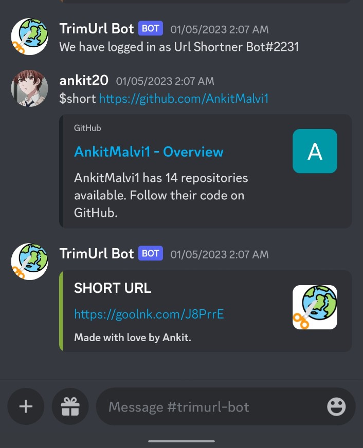

#### Objective

"The objective of this project is to create an API-based Discord bot application that allows users to shorten URLs through the use of a third-party URL shortening service."

#### Project Context

Here is a possible project context for the API-based Discord bot application for URL shortening:

URL shortening is a common practice on the internet, especially on social media platforms, where space for sharing links is often limited. By using a URL shortening service, users can create shorter, more manageable versions of long URLs, which can be shared more easily and take up less space.

Discord is a popular communication platform for online communities, particularly for gamers and other communities centered around specific interests. It allows users to communicate with each other through text, voice, and video, and also supports integrations with other tools and applications.

In this project, we will create an API-based Discord bot application that allows users to shorten URLs through the use of a third-party URL shortening service. The bot will be able to receive commands from users within Discord, initiate requests to the URL shortening service, and return the shortened URL back to the user. This will enable Discord users to easily shorten and share links within their conversations and communities.

#### Product Architecture

This Product Architecture consists of 6 stages as follows:

- Fetching data via API: The bot will use APIs to retrieve data from the URL shortening service and the Discord platform. This will allow the bot to receive commands from users and send responses back to them.
- Notification mechanism: The bot will use a notification mechanism to send data to Discord. This could be in the form of messages or other types of notifications, such as embeds or reactions.
- Discord bot: The Discord bot will be the main interface for users to interact with the application. It will be responsible for receiving commands from users and initiating requests to the URL shortening service. The bot will also be responsible for returning the shortened URL back to the user and handling any errors that may occur.
- Error handling: The bot should be designed to handle errors gracefully, such as when the URL shortening service is unavailable or when the user inputs an invalid URL. It should provide clear and helpful error messages to the user in such cases.
- User data: The bot may store user data, such as their Discord ID and history of shortened URLs. This will allow it to provide additional functionality, such as tracking the number of clicks on a shortened URL or displaying a user's history of shortened URLs.
- Security: The bot should be designed with security in mind, such as by using secure connections and protecting user data. It should also follow any relevant terms of service and privacy policies of the Discord platform and the URL shortening service.

#### High-Level Approach & Flows

- Code Implementation for Discord Server and Bot
- Connect API to Discord Server and Bot
- Notification to Discord - This is the output which is the result of this project.

#### Primary goals

- Build the URL Shortening functionality from scratch using python
- Compile, test the functionality and publish

#### Pre-requisite skills

- Python

#### Post Project Skills

- REST
- HTTP
- API
- Discord

#### Expected Outcome

